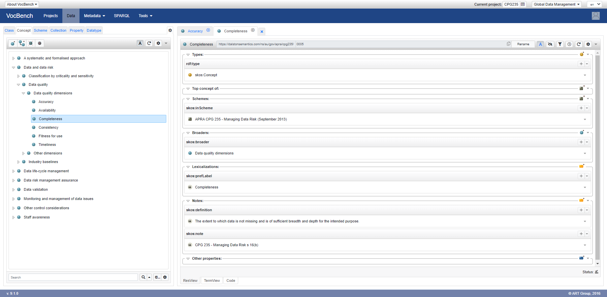

# CPG 235 Taxonomy

This taxonomy is derived from [CPG 235 - Managing Data Risk](https://www.apra.gov.au/managing-data-risk).

Use it with [Taxonomies for Confluence](https://dalstonsemantics.com/services/taxonomies-for-confluence/) to index [Confluence](https://www.atlassian.com/software/confluence) pages and track alignment with CPG 235.

Developed with [Simple Knowledge Organization System (SKOS)](https://www.w3.org/2004/02/skos/) this taxonomy can also be imported and published with [controlled vocabulary tools](https://github.com/gbv/bartoc.org/wiki/Software-for-controlled-vocabularies) to improve staff awareness of data risks.

## Attribution and Disclaimer

This work, "CPG 235 Taxonomy", is a derivative of [Prudential Practice Guide CPG 235 - Managing Data Risk (September 2013)](https://www.apra.gov.au/managing-data-risk) by [Australian Prudential Regulation Authority (APRA)](https://www.apra.gov.au/) used under [Creative Commons Attribution 3.0 Australia Licence (CCBY 3.0)](www.creativecommons.org/licenses/by/3.0/au/)

This prudential practice guide is not legal advice and users are encouraged to obtain professional advice about the application of any legislation or prudential standard relevant to their particular circumstances and to exercise their own skill and care in relation to any material contained in this guide.

APRA disclaims any liability for any loss or damage arising out of any use of this prudential practice guide.

APRA do not endorse this derivative work or its author.